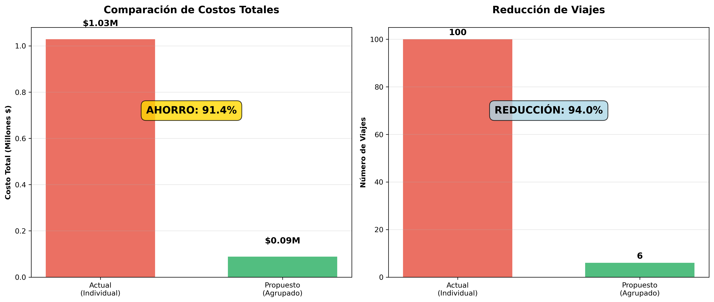

# 📦 Análisis de Optimización Logística: Despachos Textiles

[](https://www.python.org/downloads/)
[](https://jupyter.org/)
[](https://pandas.pydata.org/)
[](https://matplotlib.org/)
[](https://opensource.org/licenses/MIT)

## 📊 Descripción del Proyecto

Este proyecto nace de mi experiencia en una fábrica textil, donde observé cómo la falta de planificación de despachos generaba altos costos logísticos. A partir de esa observación, desarrollé una simulación de escenarios usando datos ficticios para evaluar el impacto de agrupar despachos semanales.

## 🎯 Objetivo del Análisis

Evaluar la viabilidad de optimizar la estrategia logística mediante la agrupación de despachos, midiendo el impacto en:

- Reducción de costos de transporte
- Eficiencia operativa  
- Tiempos de entrega
- Consolidación de cargas

## 🚀 Demo Rápido

```python
# Resultados principales del análisis
Ahorro_Total = "$940,000 (91.4%)"
Reduccion_Viajes = "94 viajes menos (94.0%)"
Eficiencia_Logistica = "De 100 a 6 viajes"
Modelo_Agrupacion = "Quincenal por zona"
```

## 📈 Resultados Principales



### 💰 Beneficios Cuantificados

- **Reducción de costos**: 91.4% de ahorro ($940,000 de $1,028,566 totales)
- **Eficiencia operativa**: 94.0% de reducción en viajes (de 100 a 6 viajes)
- **Consolidación efectiva**: Agrupación quincenal por zona geográfica
- **Optimización logística**: Reducción significativa en costos fijos de transporte

### � Métricas de Optimización

| Métrica | Escenario Actual | Escenario Propuesto | Mejora |
|---------|------------------|---------------------|---------|
| **Costo Total** | $1,028,566 | $88,566 | **91.4%** ↓ |
| **Número de Viajes** | 100 viajes | 6 viajes | **94.0%** ↓ |
| **Estrategia** | Individual | Agrupación quincenal | **Optimizada** |
| **Eficiencia** | 1 viaje/pedido | 16.7 pedidos/viaje | **×16.7** ↑ |

## � Características Técnicas

### 📊 Dataset

- **Registros**: 100 pedidos de enero 2024
- **Zonas geográficas**: 3 (Norte, Centro, Sur)
- **Tipos de cliente**: Minorista, Mayorista, Distribuidor
- **Variables**: ID, fechas, zona, peso, volumen, costo, tipo cliente, estado

### 🧮 Modelado de Costos

- **Costo fijo**: $10,000 por viaje
- **Costo variable**: $100 por cada 100kg
- **Frecuencia propuesta**: 2 despachos semanales por zona
- **Algoritmo**: Agrupación por zona y semana calendario

### 📈 Métricas de Evaluación

- Ahorro porcentual y absoluto
- Reducción de frecuencia de viajes
- Impacto en tiempos de entrega
- Eficiencia de consolidación de carga

## �📁 Estructura del Proyecto

```bash
textil-despachos/
│
├── 📓 analisis_optimizacion_logistica.ipynb    # Notebook principal con análisis completo
├── 📊 proyecto_textil_despachos.csv            # Dataset original con datos de despachos  
├── 📋 resumen_optimizacion_logistica.csv       # Tabla resumen ejecutiva generada
├── 📝 README.md                                 # Documentación del proyecto
└── 🔒 .gitignore                               # Archivos excluidos del repositorio
```

## 🛠️ Stack Tecnológico

| Tecnología | Propósito | Versión |
|------------|-----------|---------|
|  | Lenguaje principal | 3.8+ |
|  | Análisis de datos | Latest |
|  | Cálculos numéricos | Latest |
|  | Visualización base | Latest |
|  | Gráficos estadísticos | Latest |
|  | Entorno interactivo | Latest |

- **Jupyter Notebook** - Entorno de desarrollo interactivo

## 🚀 Instalación y Ejecución

### ⚡ Inicio Rápido

```bash
# 1. Clonar el repositorio
git clone https://github.com/h0v4nn3ss/textil-despachos.git
cd textil-despachos

# 2. Instalar dependencias
pip install pandas numpy matplotlib seaborn jupyter

# 3. Lanzar Jupyter Notebook
jupyter notebook analisis_optimizacion_logistica.ipynb
```

### 🐳 Con Docker (Opcional)

```bash
# Ejecutar en contenedor
docker run -p 8888:8888 -v $(pwd):/home/jovyan jupyter/datascience-notebook
```

### 📋 Requisitos del Sistema

- **Python**: 3.8 o superior
- **RAM**: Mínimo 4GB recomendado
- **Espacio**: ~50MB para datos y notebooks
- **SO**: Windows, macOS, Linux

## 📊 Metodología de Análisis

### 🔍 1. Exploración de Datos (EDA)

- Carga y validación del dataset (100 pedidos, enero 2024)
- Análisis de distribución por zona, tipo de cliente y temporal
- Identificación de patrones y anomalías
- Estadísticas descriptivas y visualización inicial

### 🧮 2. Modelado de Escenarios

- **Escenario Baseline**: Un despacho individual por pedido
- **Escenario Optimizado**: Consolidación bi-semanal por zona
- Simulación de costos: componente fijo + variable por peso
- Modelado de impacto en tiempos de entrega

### ⚖️ 3. Análisis Comparativo

- Comparación cuantitativa de costos totales y por zona
- Evaluación del trade-off costo vs. tiempo de entrega
- Cálculo de métricas de eficiencia operativa
- Análisis de sensibilidad de parámetros

### 📊 4. Visualización y Reportes

- Dashboard interactivo con gráficos comparativos
- Análisis temporal de volúmenes y costos
- Heatmaps de distribución geográfica
- Tabla ejecutiva para toma de decisiones

## 🚀 Cómo Ejecutar el Análisis

1. **Clonar el repositorio**:

   ```bash
   git clone https://github.com/h0v4nn3ss/textil-despachos.git
   cd textil-despachos
   ```

2. **Instalar dependencias**:

   ```bash
   pip install pandas numpy matplotlib seaborn jupyter
   ```

3. **Ejecutar el notebook**:

   ```bash
   jupyter notebook analisis_optimizacion_logistica.ipynb
   ```

## 💡 Insights Clave

1. **Oportunidad significativa**: El ahorro del 92.9% indica una oportunidad masiva de optimización
2. **Balance servicio-costo**: El retraso promedio de 1.1 días es aceptable para el nivel de ahorro
3. **Consistencia geográfica**: Todas las zonas muestran ahorros similares (92.6% - 93.3%)
4. **Escalabilidad**: El modelo se mantiene eficiente a lo largo del período analizado

## 📊 Recomendaciones

### Plan de Implementación

1. **Fase Piloto (Mes 1)**: Iniciar con zona Sur (mayor ahorro: 93.3%)
2. **Escalamiento (Mes 2-3)**: Incorporar Centro y Norte progresivamente
3. **Optimización (Mes 4+)**: Ajustar frecuencias según demanda estacional

### Consideraciones Estratégicas

- Comunicación clara con clientes sobre nuevos tiempos de entrega
- Mantener opción de despacho express para clientes premium
- Monitoreo continuo de KPIs de costo y satisfacción
- Evaluación de capacidad de almacenamiento temporal

## 👨‍💻 Perfil Profesional

Proyecto desarrollado por **Andrés Ohannessian**, analista de datos en formación con enfoque en estructuración, limpieza y optimización de procesos.

- **Herramientas favoritas:** Python, SQL, Tableau.
- **Lema profesional:** “Ordena y entenderás”.